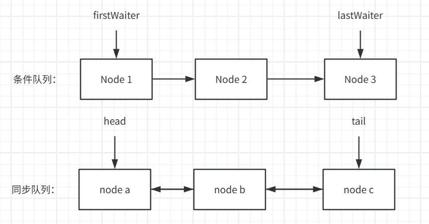
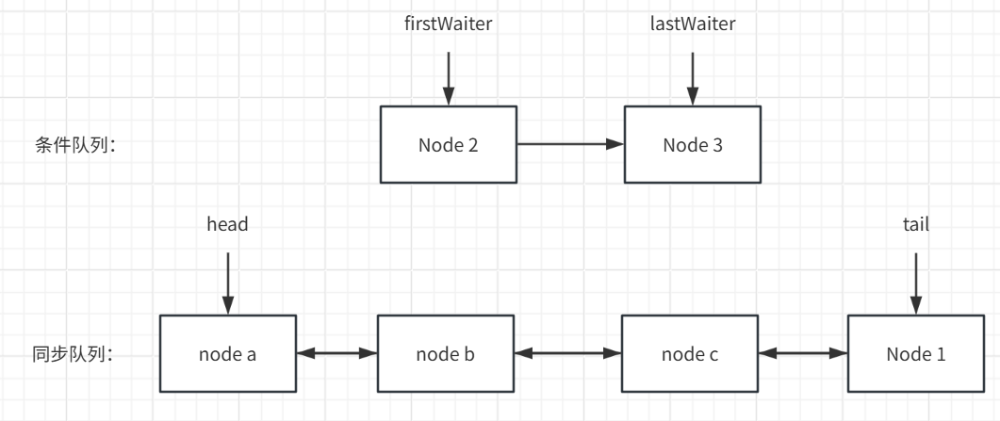

# AQS条件队列源码详细剖析

---

## 0.简介

欢迎来到我的博客：[TWind的博客](http://www.twindworld.top/)

我的CSDN:：[Thanwind-CSDN博客](https://blog.csdn.net/qq_30004513?spm=1000.2115.3001.5343)

我的掘金：[Thanwinde 的个人主页](https://juejin.cn/user/634833993739484)

最好先看过我博客中的    **《ReentrantLock的超详细源码解析》**    ，不然想要理解条件队列的源码会非常困难。

AQS中的条件队列相比同步队列略显简单，但依然优异且高效，复杂而严谨，是AQS的一大亮点

**注：本文适合想要深究AQS的条件队列的实现和原理的人参考，文章较长**

---

## 1.条件队列

对于AQS中的节点，其拥有多种状态值，比如-2就代表这个节点是属于条件队列的

**也就是说，同步队列和条件队列中的节点都是同一个数据结构来保存的，那么，就应该能够互相转化吧？**

一个条件队列是一个链表，里面的node同样是同步队列中的node的结构

其拥有两种主要方法：await和signal

await用来让一个已经获得锁的线程让出自己的锁，并把自己包装成condition，进入一个条件队列（一个条件队列由多个condition组成），然后挂起————**同步队列转移到条件队列**

signal用来从对应的条件队列中唤醒一个/全部的condition，condition**被唤醒后会把自己转移到同步队列上，像一个正常的线程那样去抢锁**————**条件队列转移到同步队列**

比如说：



当我执行了一次signal后：



这样Node 1 就会去竞争锁

这也就是条件队列的大致用法，但是这只是一个浅显的介绍，对于中断的处理，对于节点的转移才是条件队列的精华所在。

现在让我们来介绍一下AQS的条件队列的大致结构：

关于Node数据结构的介绍请参考上一篇文章

其中的Node多用到了一个**nextWaiter属性：**

这个属性在同步队列中用来标志是独享模式还是共享模式，而在条件队列中因为没有这种需求而改成了链接下一个节点

而且这是条件队列的节点的唯一一个个别的节点的联系

所以我们能知道，条件队列是一个单向链表，并不像同步队列那样是双向的

同时，其具有两个特殊值：

**firstWaiter**：

​	链接到条件队列的第一个节点

**lastWaiter**

​	链接到条件队列的最后一个节点

我们之前常常说，signal的唤醒是随机的，其实在一定程度上是有序的，你想，既然条件队列是由一个单向链表存储的，就不可能随机一个节点去删除。实际上，signal是唤醒firstWaiter来实现唤醒一个condition的

那么，signalAll就显而易见的是从头遍历到尾并唤醒其中每一个condition并将其转移到同步队列之中

那么，为了便于理解，我们就先来剖析一下signal类的代码：

---

### signal（）

```java
public final void signal() {
    if (!isHeldExclusively())	//判断是否为独享模式
        throw new IllegalMonitorStateException();//不是就抛异常
    Node first = firstWaiter;
    if (first != null)	//条件队列队首不为空就执行
        doSignal(first);
}
```

这里的isHeldExclusively是返回线程是否是独享模式，条件队列仅支持独享模式，如果是共享模式就会抛出异常

接着获取了条件队列第一个节点first，只要不为空就执行doSignal，跟入：

```java
private void doSignal(Node first) {
    do {
        if ( (firstWaiter = first.nextWaiter) == null)	//把头节点设成原头结点的后继节点后判断
            lastWaiter = null;						//如果为空，说明原本队列只有一个头节点，那也把尾结点设空
        first.nextWaiter = null;
    } while (!transferForSignal(first) &&	//如果拿出来的头节点无法转移到同步队列就重复
             (first = firstWaiter) != null);
}
```

这里有一个do-while循环，会尝试对从头到尾的第一个节点进行转移，转移成功就退出，找不到也会退出

而且在循环过程中，一直在把头节点向后设置，所以执行完毕后，同步队列会缩减到第一个能转移的节点那里，前面的节点都会被删除

让我们来看看transferForSignal方法：

```java
final boolean transferForSignal(Node node) {
    /*
     * If cannot change waitStatus, the node has been cancelled.
     */
    if (!compareAndSetWaitStatus(node, Node.CONDITION, 0))	//CAS把条件节点的状态值设成0
        return false;

    /*
     * Splice onto queue and try to set waitStatus of predecessor to
     * indicate that thread is (probably) waiting. If cancelled or
     * attempt to set waitStatus fails, wake up to resync (in which
     * case the waitStatus can be transiently and harmlessly wrong).
     */
    Node p = enq(node);		//加入同步队列，返回前驱节点
    int ws = p.waitStatus;
    if (ws > 0 || !compareAndSetWaitStatus(p, ws, Node.SIGNAL))
        LockSupport.unpark(node.thread);//如果前驱节点被取消或者无法将其状态设成-1（不是-1就不会唤醒后继），就会直接将其唤醒
    return true;						//从而防止死锁
}
```

这里会尝试把该节点的 waitStatus 通过CAS操作来修改成0

在上一篇我们知道，对于一个节点，-1代表这个节点会唤醒下一个节点，0代表无状态

那为什么不直接改成-1？原因在于我们还不知道这个节点具体的行为，就如同注释中所说：

> [!NOTE]
>
> ```java
> *   CONDITION:  This node is currently on a condition queue.
> *               It will not be used as a sync queue node
> *               until transferred, at which time the status
> *               will be set to 0. (Use of this value here has
> *               nothing to do with the other uses of the
> *               field, but simplifies mechanics.)
> ```
>
> 翻译过来就是，这个节点在转移到同步队列中会被设成0，这个0没有任何特殊的语意，只是单纯的是一个重新抢锁的节点
>
> 要是设成-1了，那我要是没后继节点，我唤醒谁啊？

如果CAS失败无法设成0，就会返回false，这样doSignal会再次while尝试


接着执行Node p = enq(node);，跟入：

```java
private Node enq(final Node node) {
    for (;;) {
        Node t = tail;
        if (t == null) { // 如果尾结点为空，代表同步队列为空，那直接把节点设成头结点就行
            if (compareAndSetHead(new Node()))
                tail = head;
        } else {
            node.prev = t;		//否则会尝试把尾节点设成自己并把自己接在上一个尾结点上
            if (compareAndSetTail(t, node)) {
                t.next = node;
                return t;
            }
        }
    }
}
```

这里会从后向前遍历尝试把节点接在尾部

执行完Node p = enq(node);，就是

```java
int ws = p.waitStatus;
if (ws > 0 || !compareAndSetWaitStatus(p, ws, Node.SIGNAL))
    LockSupport.unpark(node.thread);
return true;
```

这里有一个很重要的地方：虽然你成功的把节点加入到了同步队列，但是有可能你的前继节点被取消或各种奇奇怪怪的错误

前继节点取消或无法将其状态设成-1（唤醒后继）的话我们就得手动将其唤醒，这样我们就会被唤醒（见下方await部分）执行acquireQueued（详见上一篇）从而由AQS的同步队列将其处理


执行到这里，让我们返回doSignal

```java
private void doSignal(Node first) {
    do {
        if ( (firstWaiter = first.nextWaiter) == null)	//把头节点设成原头结点的后继节点后判断
            lastWaiter = null;						//如果为空，说明原本队列只有一个头节点，那也把尾结点设空
        first.nextWaiter = null;
    } while (!transferForSignal(first) &&	//如果拿出来的头节点无法转移到同步队列就重复
             (first = firstWaiter) != null);
}
```

这里要么是已经成功转移了要么是CAS失败再次重试（如果是后继节点出错之类的返回的是true，这种错误重试也没用），这里也就是唤醒一个条件节点并尝试将其转移到同步队列的全过程，其实相对同步队列来说相对简单,当然是在你学懂了同步队列的前提下

---

### signalAll()

```java
public final void signalAll() {
    if (!isHeldExclusively())
        throw new IllegalMonitorStateException();
    Node first = firstWaiter;
    if (first != null)
        doSignalAll(first);
}
```

显而易见的唤醒全部，直接步入doSignalAll：

```java
private void doSignalAll(Node first) {
    lastWaiter = firstWaiter = null;
    do {
        Node next = first.nextWaiter;
        first.nextWaiter = null;
        transferForSignal(first);
        first = next;
    } while (first != null);
}
```

非常的显而易见的遍历所有节点并将其加入同步队列，就不再赘述了

---

### awaitUninterruptibly()

接下来的接口都是将节点加入条件队列的接口，相对比较复杂

```java
public final void awaitUninterruptibly() {
    Node node = addConditionWaiter();	//将本线程包装成一个condition加入
    int savedState = fullyRelease(node);	//既然要加入条件队列等待唤醒，那就先把自己拿到的锁全部释放
    boolean interrupted = false;
    while (!isOnSyncQueue(node)) {	//一直阻塞等待被唤醒，如果是被中断唤醒的就设置中断标记，如果节点在中同步队列说明是被头节点
        LockSupport.park(this);		//调用release唤醒的，那就退出然后执行下面的acquireQueued尝试抢锁
        if (Thread.interrupted())
            interrupted = true;
    }
    if (acquireQueued(node, savedState) || interrupted)	//如果抢锁过程被中断过或者在条件队列等待时被中断过，就会调用一下
        selfInterrupt();							//selfInterrupt，重新设置一下中断位，因为interrupted会清除中断位
}
```

这是最简单的把节点加入条件队列的方法，因为其不会抛出中断异常，省去了很多判断

会先把节点加入条件队列，然后将其堵塞，等待唤醒

这里要么会被中断唤醒,要么是被同步队列唤醒，如果此时已经在同步队列中的就可以尝试抢一次锁（acquireQueued），如果这个节点没抢到那就在条件队列阻塞，因为完全可能是还没有排到队头就被另外一个中断唤醒了

看一下fullyRelease：

```java
final int fullyRelease(Node node) {
    boolean failed = true;
    try {
        int savedState = getState();	//获取当前锁重入次数
        if (release(savedState)) {		//释放锁
            failed = false;
            return savedState;
        } else {
            throw new IllegalMonitorStateException();
        }
    } finally {
        if (failed)
            node.waitStatus = Node.CANCELLED;
    }		//如果抛异常代表释放出错，就把该节点设成CANCELLED，让同步队列处理
}
```

因为必须要有锁才能await，所以这里大概率是能成功release掉锁的，release不掉就取消节点交给同步队列（release会唤醒同步队列的下一个节点）


看一看加入条件队列的代码：

```java
private Node addConditionWaiter() {
    Node t = lastWaiter;
    // 获取最后一个节点
    if (t != null && t.waitStatus != Node.CONDITION) {
        unlinkCancelledWaiters();	//如果这个节点不合法，就会取消掉它
        t = lastWaiter;		//获取新的尾节点，unlinkCancelledWaiters会清除整个条件队列的不合法节点
    }	
    Node node = new Node(Thread.currentThread(), Node.CONDITION);
    if (t == null)
        firstWaiter = node;
    else
        t.nextWaiter = node;
    lastWaiter = node;	//单纯的新建一个节点加进去
    return node;
}
```

会尝试加在尾部，如果发现尾部节点不合法，会触发清理，再加上去


看一看unlinkCancelledWaiters是怎么工作的：

```java
private void unlinkCancelledWaiters() {
    Node t = firstWaiter;
    Node trail = null;	//维护上一个合法的节点
    while (t != null) {
        Node next = t.nextWaiter;
        if (t.waitStatus != Node.CONDITION) {
            t.nextWaiter = null;
            if (trail == null)
                firstWaiter = next;
            else
                trail.nextWaiter = next;
            if (next == null)
                lastWaiter = trail;
        }
        else
            trail = t;
        t = next;
    }
}
```

非常的显而易见的从头遍历到尾，取消掉每一个不合法的节点（status不为CONDITION）


isOnSyncQueue就不贴了，就是一个重后向前遍历找节点的方法

---

### await()

这是重头戏，引入了对中断的详细处理

```java
public final void await() throws InterruptedException {
    if (Thread.interrupted())
        throw new InterruptedException();	//如果已经被中断了就直接抛异常
    Node node = addConditionWaiter();	//加入条件队列
    int savedState = fullyRelease(node);	//释放锁
    int interruptMode = 0;	//标记处理中断的模式
    while (!isOnSyncQueue(node)) {
        LockSupport.park(this);	//阻塞
        if ((interruptMode = checkInterruptWhileWaiting(node)) != 0)	//调用checkInterruptWhileWaiting来判断中断模式
            break;			//如果有中断就跳出来处理
    }
    if (acquireQueued(node, savedState) && interruptMode != THROW_IE)
        interruptMode = REINTERRUPT;	//如果获取锁阶段被打断而且打断模式不是THROW_IE，就会简单设置中断标记
    if (node.nextWaiter != null) //如果下一个条件队列节点为空，就会清理一遍队列
        unlinkCancelledWaiters();
    if (interruptMode != 0)		//根据对应的中断类型执行不同操作
        reportInterruptAfterWait(interruptMode);
}
```

这里会尝试加入条件队列并阻塞，并在唤醒后看看自己是不是被中断的，如果是的话就判断中断的类型，采取相应的操作，不像上面的awaitUninterruptibly直接忽略异常

让我们来看看checkInterruptWhileWaiting是怎么判断异常的：

```java
private int checkInterruptWhileWaiting(Node node) {
    return Thread.interrupted() ?
        (transferAfterCancelledWait(node) ? THROW_IE : REINTERRUPT) :
        0;
}
```

如果线程被中断(Thread.interrupted)就会判断transferAfterCancelledWait，是真返回THROW_IE（抛出异常），否则返回REINTERRUPT（重新设置中断位）

步入transferAfterCancelledWait看看

```java
final boolean transferAfterCancelledWait(Node node) {
    if (compareAndSetWaitStatus(node, Node.CONDITION, 0)) {	//注意！如果这个CAS能成功说明这个节点还没有进入同步队列
        enq(node);										//也就是说还没有signal，那就直接将其移入同步队列然后等待获取锁后
        return true;									//将其清除
    }

    while (!isOnSyncQueue(node))		//如果到了这里，说明一开始的节点已经或正在进入同步队列，就是已经被signal了
        Thread.yield();					//那就不断的yield等待其成功进入同步队列再进行下一步操作
    return false;
}
```

这里会判断这个中断的发生时间：是在signal前面还是后面

因为如果signal没发生那CAS就能成功，那就手动加入同步队列等待其拿到锁后让AQS将其删除，随后抛出异常

不能草率的直接将其删除，因为后面你还得执行acquireQueued来拿回锁来统一处理

如果已经signal，就等到signal完成后重设一下中断位即可

接下来，就根据判断的结果调用reportInterruptAfterWait：

```java
private void reportInterruptAfterWait(int interruptMode)
    throws InterruptedException {
    if (interruptMode == THROW_IE)
        throw new InterruptedException();
    else if (interruptMode == REINTERRUPT)
        selfInterrupt();
}
```

如果是THROW_IE，对应未调用signal，就抛出异常

否则，只是修改符号位

---

### awaitNanos(),awaitUntil(Date deadline),await(long time, TimeUnit unit)

判断逻辑和await()没什么区别，唯一的不同是加了个超时机制

这里以awaitNanos示例：

```java
public final long awaitNanos(long nanosTimeout)
        throws InterruptedException {
    if (Thread.interrupted())
        throw new InterruptedException();
    Node node = addConditionWaiter();
    int savedState = fullyRelease(node);
    final long deadline = System.nanoTime() + nanosTimeout;	//设置超时时间
    int interruptMode = 0;
    while (!isOnSyncQueue(node)) {
        if (nanosTimeout <= 0L) {	//如果超时就取消该节点
            transferAfterCancelledWait(node);
            break;
        }
        if (nanosTimeout >= spinForTimeoutThreshold)
            LockSupport.parkNanos(this, nanosTimeout);
        if ((interruptMode = checkInterruptWhileWaiting(node)) != 0)
            break;
        nanosTimeout = deadline - System.nanoTime();
    }
    if (acquireQueued(node, savedState) && interruptMode != THROW_IE)
        interruptMode = REINTERRUPT;
    if (node.nextWaiter != null)
        unlinkCancelledWaiters();
    if (interruptMode != 0)
        reportInterruptAfterWait(interruptMode);
    return deadline - System.nanoTime();
}
```

其他地方一模一样

---

## 总结

总的来说，条件队列相对简单，围绕着：包装成condition->转移到同步队列就能很容易理解

当然，这一切都建立在你熟悉同步队列的实现和原理的前提之下

后面会介绍分享模式，读写锁之类的，欢迎捧场！
