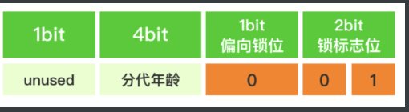
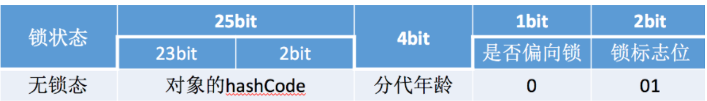

# 为什么64位的JVM的对象头中的HashCode长度是31

---

欢迎来到我的博客：[TWind的博客](http://www.twindworld.top/)

我的CSDN:：[Thanwind-CSDN博客](https://blog.csdn.net/qq_30004513?spm=1000.2115.3001.5343)

我的掘金：[Thanwinde 的个人主页](https://juejin.cn/user/634833993739484)


最近在学juc，看到对象头的解析，突然发现64位下无锁态的HashCode长度为31bits，32位是25bit，当时就在想，为什么是31？String的默认hashCode也是31，两者之间有什么联系吗？可惜的是没能在中文平台发现答案，外文平台经过一番查找终于找到了答案...

---

## 先来看64位无锁态对象头的结构：**


其中的hashcode占到了31bits

我们打开idea，使用

```java
        <dependency>
            <groupId>org.openjdk.jol</groupId>
            <artifactId>jol-core</artifactId>
            <version>0.17</version>
        </dependency>
```

中的

```java
ClassLayout.parseInstance(对象).toPrintable()
```

就能获得一个对象的详细信息：

```
OFF  SZ               TYPE DESCRIPTION               VALUE
  0   8                    (object header: mark)     0x0000001626786201 (hash: 0x16267862; age: 0)
  8   4                    (object header: class)    0x00067248
 12   4   java.lang.String Dog.username              (object)
 16   4   java.lang.String Dog.password              (object)
 20   4                    (object alignment gap)    
```

注意！新创建的对象是默认偏向锁，你获得的结果会是偏向锁的数据！**（原因详见jvm的锁机制）**

必须要手动掉一次 对象.**hashCode();** 方法才会将其转化为无锁态！

把0x0000001626786201转化为二进制：

**1011000100110011110000110001000000001**

可以看到只有37位，不是说mark_word一共有64位吗，但你从上图可以看到有总共26的空间没用到，所以实际上应该是：

**<font color=blue>00000000000000000000000000</font><font color=red>010110001001100111100001100010</font><font color=blue>0</font><font color=black>0000</font><font color=yellow>001</font>**

其中红色为哈希部分，蓝色为未使用部分，黄色为锁位，这里是001，说明是无锁态

好了，现在来解释，为什么选择31，明明还有这么多空闲位置却不用？

让我们来看**markOop.hpp**（[jdk7/jdk7/hotspot: 9b0ca45cd756 src/share/vm/oops/markOop.hpp](https://hg.openjdk.org/jdk7/jdk7/hotspot/file/9b0ca45cd756/src/share/vm/oops/markOop.hpp)）

里面提到了：

```c
//  - hash contains the identity hash value: largest value is
//    31 bits, see os::random().  Also, 64-bit vm's require
//    a hash value no bigger than 32 bits because they will not
//    properly generate a mask larger than that: see library_call.cpp
//    and c1_CodePatterns_sparc.cpp.
```

可以知道，

1.os::random()方法只能产生31位的数字，这很好理解，int就是2^31-1

**有人会问int不应该是32位吗？但是hashCode没有负数，就去掉int的一个符号位，成了31位**(一些情况下会是负数，但这种设定决定了负数决不会是正常情况，大多是计算溢出导致的，或者一些方法抛弃了哈希质量产生了负数)

2.64位的JVM要求hashCode不能超过32位，不然会因为无法产生一个比其更大的掩码而出错

通过这个，我们也能理解为什么java中hashCode返回的是32位的int，原因很简单：**更大的数有风险，且需要避免负数**

个人觉得还有个原因，2^31 - 1已经很庞大了，所以没必要用到其他空闲部分接着做hashCode

况且对于底层有**内存对齐要求**，系统会把**字节**作为一个单位读取（其实也有双字节，四字节读取，计算机是用**块**来读取的），你可以看到：



这里加上分出来的一个未使用的1bit正好是8bit，也就是一字节，能直接读取，效率较高

对于前面的

**<font color=yellow>其实严格来说hashcode是32位的，因为会分一个bit到31bit上组成4字节来直接读取，前面的unused部分也是24位，3字节方便偏移读取</font>**

只是这个bit仅仅只是用来对齐的，不属于hashcode，hashcode还是只有31bit

---

至于32位JVM的对象头:


25bit是实在没空间的做出的一种妥协，因为25不是8的倍数，效率方面上会有一定的损失

其他地方同64位并没有太多区别