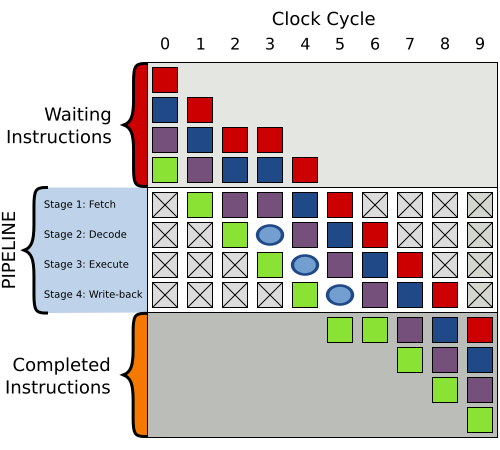

# 关于JVM和OS中的指令重排以及JIT优化

---

欢迎来到我的博客：[TWind的博客](http://www.twindworld.top/)

我的CSDN:：[Thanwind-CSDN博客](https://blog.csdn.net/qq_30004513?spm=1000.2115.3001.5343)

我的掘金：[Thanwinde 的个人主页](https://juejin.cn/user/634833993739484)

## 前言：

这东西应该很重要才对，可是大多数博客都是以讹传讹，全是错误，尤其是JVM会对字节码进行重排都出来了，明明自己测一测就出来的东西，写出来误人子弟...
研究了两天，算是有点名堂了，只是不能看到到CPU的重排过程有点可惜
纸上得来终觉浅，建议手动截一下字节码以及汇编自己研究一下，肯定会有不一样的收获
关于JMM和JIT可以尝试看一下油管**Jakob Jenkov**的教程，很不错

---

​	通俗易懂的说，指令重排是为了最大化执行效率，会在**保证语意不变**的情况下，调整代码的顺序。

## OS中的指令重排:

比如：

```java
a = b + c;
b = a + c;
d = e + f;
e = d + f;
```

这段代码可能会被调整为:

```java
a = b + c;
d = e + f;
b = a + c;
e = d + f;
```

但是肯定不会调整为：

```java
b = a + c;
a = b + c;
d = e + f;
e = d + f;
```

因为这样改变了代码语意

具体会调成什么样取决于**JVM和OS**

**实际上来说，指令重排并不是以一行java代码为单位进行的，也就是说，我举的例子并不恰当**

一行代码是由多句指令构成的，比如一个简单的Java程序：

```java
public class test {
    public static void main(String[] args) {
        int a = 1;
        int b = 2;
        int c = a + b;
    }
}
```

其转化为字节码：

```java
public class test {
  // 构造函数的声明
  public <init>()V  // 这是无参构造方法，返回类型为 void
   L0
    LINENUMBER 1 L0  // 表示该字节码位置对应源代码的第 1 行
    ALOAD 0  // 将当前对象（this）加载到栈上。这里的 0 表示加载 this（当前对象）。
    INVOKESPECIAL java/lang/Object.<init> ()V  // 调用父类 Object 的构造方法（<init>），构造函数是无参的
    RETURN  // 从构造方法中返回
   L1
    LOCALVARIABLE this Ltest; L0 L1 0  // 在字节码中定义了一个局部变量 'this'，类型是 test，对应的范围是 L0 到 L1，局部变量索引为 0
    MAXSTACK = 1  // 最大栈深度为 1
    MAXLOCALS = 1  // 最大局部变量数为 1
  // main 方法的声明
  public static main([Ljava/lang/String;)V  // main 方法，接受字符串数组作为参数，返回类型为 void
   L0
    LINENUMBER 3 L0  // 表示该字节码位置对应源代码的第 3 行
    ICONST_1  // 将常量 1 压入栈中
    ISTORE 1  // 将栈顶的值（1）存入局部变量 1 中
   L1
    LINENUMBER 4 L1  // 表示该字节码位置对应源代码的第 4 行
    ICONST_2  // 将常量 2 压入栈中
    ISTORE 2  // 将栈顶的值（2）存入局部变量 2 中
   L2
    LINENUMBER 5 L2  // 表示该字节码位置对应源代码的第 5 行
    ILOAD 1  // 将局部变量 1 的值（即 1）加载到栈上
    ILOAD 2  // 将局部变量 2 的值（即 2）加载到栈上
    IADD  // 将栈顶的两个整数相加（1 + 2 = 3）
    ISTORE 3  // 将结果（3）存入局部变量 3 中
   L3
    LINENUMBER 6 L3  // 表示该字节码位置对应源代码的第 6 行
    RETURN  // 返回，从 main 方法中返回
   L4
    LOCALVARIABLE args [Ljava/lang/String; L0 L4 0  // 定义了局部变量 args，类型为 String[]，范围是 L0 到 L4
    LOCALVARIABLE a I L1 L4 1  // 定义了局部变量 a，类型为 int，范围是 L1 到 L4
    LOCALVARIABLE b I L2 L4 2  // 定义了局部变量 b，类型为 int，范围是 L2 到 L4
    LOCALVARIABLE c I L3 L4 3  // 定义了局部变量 c，类型为 int，范围是 L3 到 L4
    MAXSTACK = 2  // 最大栈深度为 2
    MAXLOCALS = 4  // 最大局部变量数为 4
}
```

可以看到，转换成字节码多出了很多操作

其实字节码转成机器码/汇编时还会接着细分，为了演示就不再向下分析了

那么转换成字节码后我们会发现什么？

一个简单的 **int a = 1;**被转化成了

```java
    LINENUMBER 3 L0  // 表示该字节码位置对应源代码的第 3 行
    ICONST_1  // 将常量 1 压入栈中
    ISTORE 1  // 将栈顶的值（1）存入局部变量 1 中
    LOCALVARIABLE a I L1 L4 1  // 定义了局部变量 a，类型为 int，范围是 L1 到 L4
```

**展示的目的在于，每一行代码把其溯源到底层的机器码，都是由一系列操作组成的**

一般可以分为：

* 取指（IF）：从存储器中读取指令，并将指令送入指令寄存器IR；同时更新程序计数器PC，指向下一条指令的地址。
* 译码（ID）：对IR中的指令进行译码，确定操作码、操作数和功能；同时从寄存器文件中读取源操作数，并放入临时寄存器A和B中；如果有立即数，还要进行符号扩展，并放入临时寄存器Imm中。
* 执行（EX）：根据操作码和功能，对A、B或Imm中的操作数进行算术或逻辑运算，并将结果放入临时寄存器ALUOutput中；或者根据操作码和功能，对A和Imm中的操作数进行有效地址计算，并将结果放入临时寄存器ALUOutput中。
* 访存（MEM）：如果是加载指令，从存储器中读取数据，并放入临时寄存器LMD中；如果是存储指令，从B中读取数据，并写入存储器中；如果是分支指令，根据条件判断是否跳转，并更新PC。
* 写回（WB）：如果是运算指令或加载指令，将ALUOutput或LMD中的结果写回目标寄存器；如果是其他类型的指令，则不进行写回操作。

**（这些操作在上述字节码不太能看出来，因为这是针对汇编/机器码而设计的）**

知道指令是由这么一个顺序来的了，那这和指令重排有什么关系呢？

你或许会发现，或许我们可以不用从上到下执行完所有指令，而是挑一些可以**并发**一起执行？

比如我们可以在**执行一条指令的IF时还能执行别的指令的ID**？

但有人不就会问CPU不就单核怎么做到？

CPU是单核，但每条指令用到的单元不一样啊，取指用PC寄存器，计算时就用ALU，互不干扰！

所以我们完全可以**调整这些指令的执行顺序来做到最大化效率**

而这种技术称之为**指令流水线**

而拥有像上面五层指令执行类别的CPU的流水线称之为五层流水线


这张图展示的处理器就能同时执行五条指令，原理就是充分利用了CPU中的其他单元，形成了一种“伪并行”

**能够“预测”到后面的指令，并能找到可以提前用空闲的处理单元处理的指令提取执行**

这样对计算机的提升非常大，以至于有CPU拥有1000多层的流水线

那CPU是怎么知道该怎么样找到可以并发的指令？

是通过分析“**数据依赖**”来发现那些可以并行运行

那既然存在数据依赖，那就一定会存在一种情况：下个指令必须用到上个指令的结果，且没有其他指令能插进来

那这样就会产生**气泡**，也称为**“打嗝”**：



一旦产生了气泡，会让后续操作周期延误，所以，为了维持流水线的高效率，CPU会尽力去进行**指令重排**来填补气泡

让能并发执行（互不干扰）的指令提前执行来填补气泡，避免延误执行周期

**那么古尔丹，代价是什么呢？**

**尽管指令重组能保证语义不变，但不能保证在高并发条件下不会出错！**

**毕竟提前和延后修改共享变量都可能会引起不可预测的错误！**

**所以会采用synchronized 或 volatile 来针对性的避免这种情况**

---

## JVM中的指令重排与优化:

​	**JVM中的指令重排和优化是发生在JIT编译阶段，而不是翻译成字节码阶段**，网上很多博客都说错了！

​	仔细想一下也很正常，指令重排针对的是汇编机器码层面的操作，字节码根本接触不到

​	想要验证很简单，你找个程序，挑个能体现指令重组的程序，比较一下加了volatile和不加volatile的字节码，你会发现除了那个加了volatile的变量之外根本没区别

​	**而且Java是解释+编译，一般情况下是由JVM一句一句照着字节码翻译成机器码走一步看一步，遇到有循环，执行多次的代码块就会用JIT对其进行编译优化，下次执行就直接调用JIT编译出来的机器码**

​	所以很容易理解JVM的指令重排发生在JIT编译阶段

​	那JIT的代码重排主要是干什么呢？

​	JIT会根据JVM的不同（也就是底层的不同），适当的修改代码，调整顺序来迎合OS的流水线和指令重排。

​	JIT也会给你写的屎山做优化，优化一些不必要的操作

​	举个例子：

```java
package com.jitTest;

public class test {
    static boolean noUse = true;
    public static void main(String[] args) {
        int cnt = 0;
        while(noUse){
            cnt++;
            if(cnt == 10000)
                break;
        }
    }
}
```

这里循环了10000次，肯定会触发JIT的热点代码优化

我们先下一个JITWatch

使用教程参考[JITWatch很折腾？有这篇文章在可以放心大多数情况下，通过诸如javap等反编译工具来查看源码的字节码已经能够满足我 - 掘金](https://juejin.cn/post/7162926791928053796)

但是别照着它去自己编译dll，可直接在[atzhangsan/file_loaded](https://github.com/atzhangsan/file_loaded)下载，JITWatch要下载源码手动编译，不能下jar！

之后我们用JITWatch截取其字节码和汇编代码：

字节码：

```java
 0: iconst_0        
 1: istore_1        
 2: getstatic       #2   // Field noUse:Z
 5: ifeq            21   
 8: iinc            1, 1 
11: iload_1         
12: sipush          10000
15: if_icmpne       2    
18: goto            21   
21: return    
```

可以发现根本没有优化掉**noUse**变量，这也证明之前的“**代码重排发生在JIT编译而不是JVM编译成字节码**”

接下来看汇编部分：

```java
# {method} {0x000001a4d3fd44f0} 'main' '([Ljava/lang/String;)V' in 'com/jitTest/test'
# parm0:    rdx:rdx   = '[Ljava/lang/String;'
#           [sp+0x20]  (sp of caller)
[Entry Point]
0x000001a4b23e6140: sub $0x18,%rsp
0x000001a4b23e6147: mov %rbp,0x10(%rsp)  ;*synchronization entry
                                         ; - com.jitTest.test::main@-1 (line 6)
0x000001a4b23e614c: add $0x10,%rsp
0x000001a4b23e6150: pop %rbp
0x000001a4b23e6151: test %eax,-0x1e36157(%rip)  # 0x000001a4b05b0000
                                                ;   {poll_return} *** SAFEPOINT POLL ***
0x000001a4b23e6157: retq
0x000001a4b23e6158: hlt
0x000001a4b23e6159: hlt
0x000001a4b23e615a: hlt
0x000001a4b23e615b: hlt
0x000001a4b23e615c: hlt
0x000001a4b23e615d: hlt
0x000001a4b23e615e: hlt
0x000001a4b23e615f: hlt
[Exception Handler]
[Stub Code]
0x000001a4b23e6160: jmpq 0x000001a4b2264620  ;   {no_reloc}
[Deopt Handler Code]
0x000001a4b23e6165: callq 0x000001a4b23e616a
0x000001a4b23e616a: subq $0x5,(%rsp)
0x000001a4b23e616f: jmpq 0x000001a4b2006f40  ;   {runtime_call}
0x000001a4b23e6174: hlt
0x000001a4b23e6175: hlt
0x000001a4b23e6176: hlt
0x000001a4b23e6177: hlt
```

其中的：

```java
[Entry Point]
0x000001a4b23e6140: sub $0x18,%rsp
0x000001a4b23e6147: mov %rbp,0x10(%rsp)  ;*synchronization entry
                                         ; - com.jitTest.test::main@-1 (line 6)
0x000001a4b23e614c: add $0x10,%rsp
0x000001a4b23e6150: pop %rbp
0x000001a4b23e6151: test %eax,-0x1e36157(%rip)  # 0x000001a4b05b0000
                                                ;   {poll_return} *** SAFEPOINT POLL ***
0x000001a4b23e6157: retq
```

便是函数部分，我们可以看到，其中唯一的**比较函数**就是 0x000001a4b23e6151: test %eax,-0x1e36157(%rip) ，代表着比较cnt是否到了10000，根本没有看见判断**noUse**变量是否为真

说明**JIT编译**时就已经发现**noUse变量很no use**，就将其删去了

对于指令重排，其实不太好测出来，**复杂程序的汇编你看不出来，简单程序的汇编又被JIT优化后因为太简单就会按顺序执行**

而且具体重组的方法是由你的底层决定，**大头也是CPU的指令重排**，JIT也是打个下手

但由此我们完全可以看出JIT可以对代码进行修改优化和重构来**提升效率**

  ~~**JIT完全是Java的大爹**~~  

---

## 总结：

​	OS中的指令重排极大的提升了CPU性能，但也带来了并发风险

​	JVM中的JIT会在字节码转机器码时对代码进行优化修改以及重排，极大的提升了Java的速度，使其与编译执行语言速度相媲美

​	JIT太猛了...写的一个一百多行的测试屎山给优化到只有十几行...


