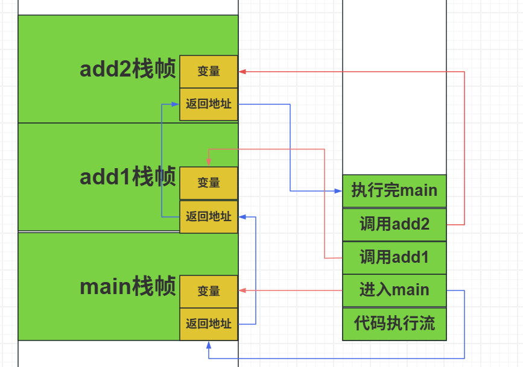
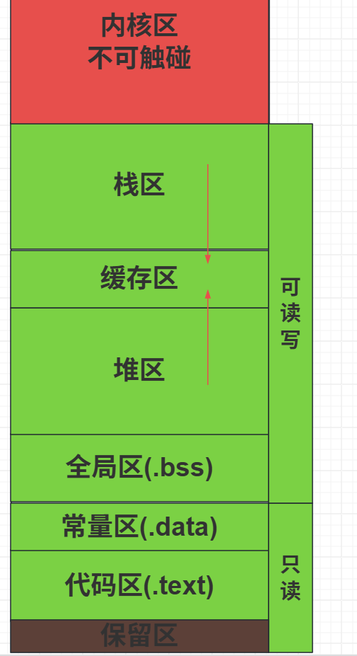
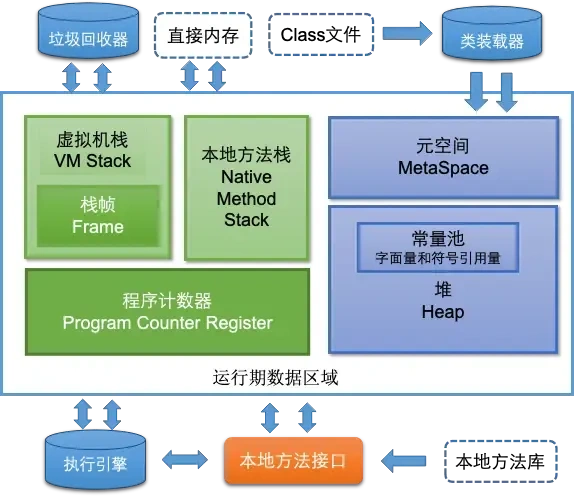

# 关于JVM和OS中的栈帧的区别和内存浅析

---

欢迎来到我的博客：[TWind的博客](http://www.twindworld.top/)

我的CSDN:：[Thanwind-CSDN博客](https://blog.csdn.net/qq_30004513?spm=1000.2115.3001.5343)

我的掘金：[Thanwinde 的个人主页](https://juejin.cn/user/634833993739484)

刚看了黑马JVM中的栈帧的讲解，感觉和自己理解的栈帧有一定出入，查询资料研究了一下发现的确有天壤之别，可惜黑马并没有讲。

故写下这篇文章巩固一下,,,

---

## OS的栈帧：

​	OS的栈帧会在调用一个函数时，分配一段内存，存入函数调用的局部变量、参数、返回地址等信息进去，列如下面这一段C程序：

```c
#include<stdio.h>
int add1(int a, int b) {
    return add2(a,b);
}
int add2(int a, int b) {
    return a + b;
}
void main(){
    add1(1,2);
}
```

首先，程序会把这个代码从上开始执行

当执行到main函数时，会在内存上分配如下：


这里的**返回地址**指的是进入这个函数的**指令地址**，也就是**程序计数器（PC）**寄存器，里面保存的是下一条被执行的语句的位置，因为你调用了函数，PC就得移到函数代码的地方，**为了执行完函数能回到原代码**，就会在函数的栈帧里面保存返回地址，这样执行完函数就会通过返回地址返回到原本的地方继续执行。

---

接着进入add1，add2就显而易见：



**栈帧是用栈来存储的，遵循先进先出，程序只能操作最顶上的栈帧！**

每当执行到一个函数，就会创建一个栈帧，存储变量和对应返回地址，**当执行完毕后，栈帧会被回收**

**这也就是为什么函数需要预先声明要用的变量的原因，计算机需要知道你的大小和所需来为你分配合适的栈帧。**

**你只能使用你栈帧里面的数据，一旦越界访问就会报错**

总的来说，栈帧在OS里面会保存函数执行的**一切信息**，包括变量对象，返回地址，各种参数

但对于全局变量，以及类似于C++中的vector这种动态申请空间的，栈帧里面只会存对其的**内存地址**（可以理解为指针），实际上其处于另一片区域中，具体看程序内存分配的**总体图**：

	这也被称为内存五大区：**栈区` -> `堆区` -> `全局静态区` -> `常量区` -> `代码区**

各个区解释如下：

内核区，是OS的系统文件或其他文件，反正不应该被程序触碰到，接触到就会报错

栈区，也就是上文提到的栈帧存放处，**从上到下存储！**

堆区, 存储程序手动分配的空间，也就是new，vector此类，读取较慢

全局区，存储全局变量

常量区，存储常量

代码区，存储原代码

保留区，4k大小，不作操作

**对于32位计算机，全部部分加起来一共有4G**

栈区是从上到下使用，堆区是从下到上

缓存区用来作缓冲，双方都能使用

一旦冲突，便会发生**溢出错误**

以上是OS中栈帧的简单解释

---

## JVM的栈帧：

**Java这种高级语言的栈帧和OS中的栈帧是两个东西**

本质是JVM抽象出来的，和OS的栈帧没有关系

但是结构差不多，可以说较为相似

（来自小林coding)

**这里的本地方法指的是native方法，不是由java实现的方法！是由C语言实现的来对底层进行交互的方法！**

**那本地方法栈完全可以套用前文**

**对于Java虚拟机栈帧，仅和OS栈帧有一点区别：其不会把数据对象存储在栈帧中，而是只会存储一个引用！**

**对象本身是存在堆中的，和OS的栈帧不同**

堆是 JVM 中最大的一块内存区域，被所有线程共享，在虚拟机启动时创建，用于存放对象实例。

程序计数器（PC）效果和OS相同，都是存储下一条该执行的语句的地址

元空间用于存储已被虚拟机加载的类信息、常量、静态变量等数据

直接内存不属于 JVM 运行时数据区的一部分，通过 NIO 类引入，是一种堆外内存，可以显著提高 I/O 性能。

---

总的来说，JVM和OS的内存管理结构上其实并没有很大区别，只是需要注意，JVM的内存是对OS的内存的一次抽象，是间接实现的，不是像OS那样通过汇编直接实现.

所以说既然不是直接实现的，那就必然会对性能有影响，这也是java性能不如C的原因之一

栈帧也是对OS的栈帧的模拟，区别在于不会把所有对象都放在栈帧中，而是放在堆中，这是和OS的区别
