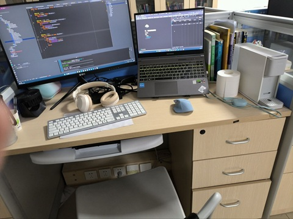
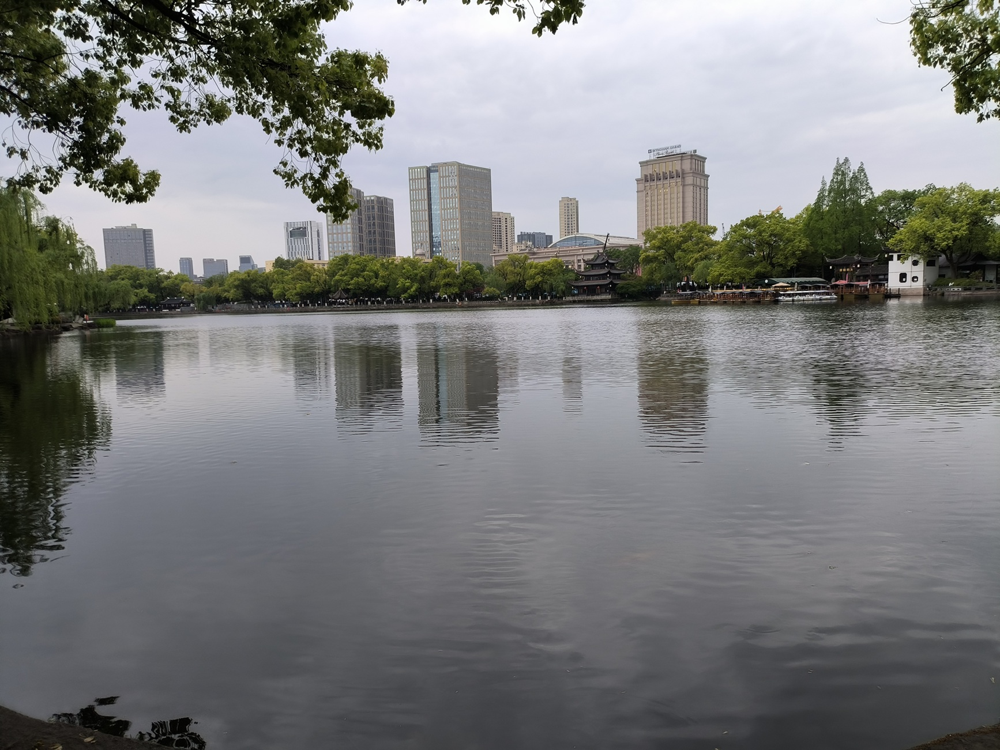
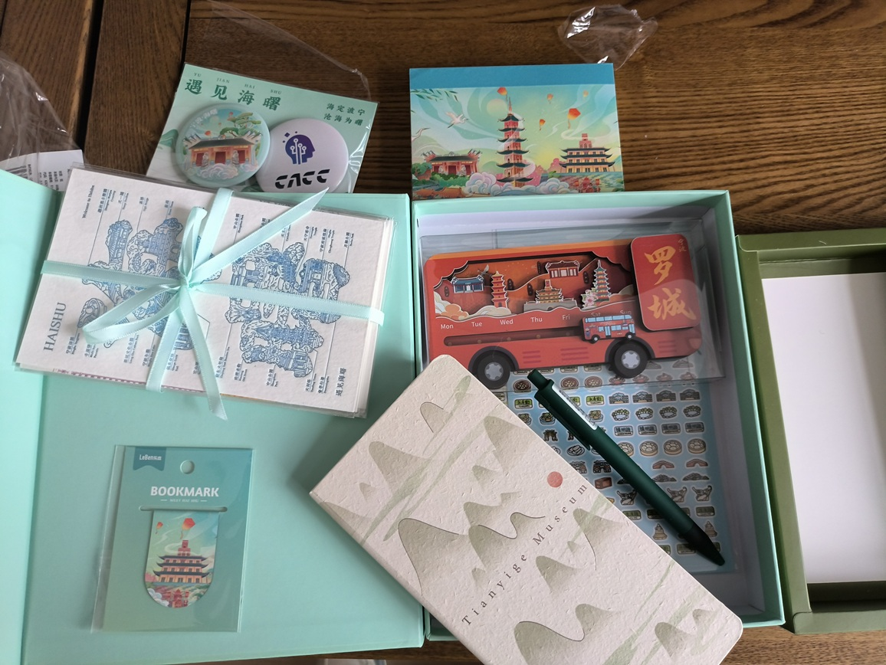
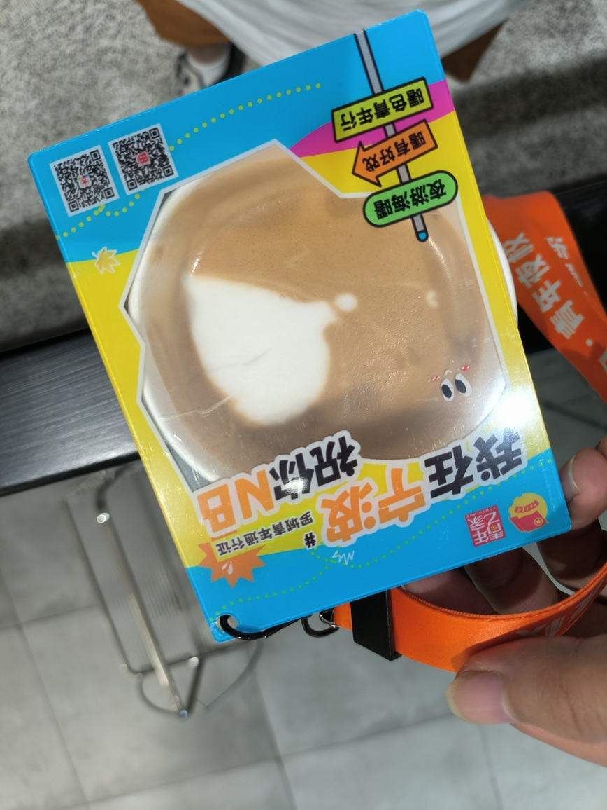

# 大一上结束随笔

---

欢迎来到我的博客：[TWind的博客](http://www.twindworld.top/)

我的CSDN:：[Thanwind-CSDN博客](https://blog.csdn.net/qq_30004513?spm=1000.2115.3001.5343)

我的掘金：[Thanwinde 的个人主页](https://juejin.cn/user/634833993739484)

2025.4.20书

时间倒是挺快的，一转眼就到了大一下

感觉自己倒是还没学什么东西（笑）

现在人还坐在CACC的宾馆里面，没啥想干的，就写写字吧（宁波政府真有钱）

---

在开学前，其实我就了解了很多。

包括但不限于，大环境严峻，课程无用等等等等。

庆幸我有不错的毅力，并没有花费太多时间在大学生活上。

虽然是有些奇怪，但我倒是乐在其中，虽然错过了一些别人的好意，但也算有所得。

开学前一段时间，虽然我第一时间翘掉了能翘的课，投入了图书馆，但还是有许些迷茫，不知该怎么发展。

花了一段时间来打ACM（之前是oi）。

碰巧认识了wsc学长（ai大佬&好兄弟），读了zx（腾讯wxg）的blog，并和他聊了会，

又机缘巧合认识了jx（offer收割机）和lxl（B站），吃了顿饭，对就业方向和该怎么努力有了一个大致的认识。

于是决定放弃ACM，全力堆技术。

原因有很多，一是性价比太低，二是不想再当做题蛆了，寒窗苦读读够了，想干一些实事了。

正好我们学校有两个工作室，蓝山和红岩，里面有很多人都进了大厂，我就想努努力通过他们的考核

（原本想去红岩的，结果红岩的web没更新，联系不上，就去了蓝山，感谢hyh学长）

在学校里面就是平平无奇的宿舍->食堂->图书馆三点一线，日复一日，年复一年

很多人觉得我这样很夸张，有这样的想法我也理解

我一直是一个崇尚未雨绸缪的人，想东西都会尽我所能想得很深，看东西也会尝试从多个角度看

而且每个人的要求，认知，见识，乃至家庭背景都不一样，并不是每个人都能有我这种想法和决心

目前环境如此，不管是为了我的生计，还是我所谓的理想，都会推动我付诸行动

还好对这些东西还算有兴趣，乐在其中也不是很煎熬

就这样熬着熬着到了大一下...

---

换了寝室，远离了原寝室里面的喧嚣和嘈杂，来了一个友好且安静的寝室，精神状态都好了不少

一开始我还会尝试去“拯救”别人，但事实证明，每个人的苦难都是有原因的

但还好还是让一些人醒悟过来，开始进入现实了

`放弃助人情绪，尊重他人命令`

和wsc讲到这些的时候都会提几句这段话（笑）

三月份时，由于蓝山工作室那边看我学得进度很快，正好也有一个重庆市的项目可能要重启，索性让我破格进来了

蓝山工位真舒服.ing

这里的气氛很不错，工位也很棒，能让你爽卷一天（图书馆经常有很多神人）

一直卷到了期中，正好CCF办的CACC和我的期中考试冲突了

我想着我本来就什么都不会，正好拿来公费旅游，冲掉期中还能给我平均分（比我自己考要高）

于是...

宁波好玩捏

鼓楼好看

政府送的小礼物

拉的四不像...

---

虽然这个比赛没什么意义，但我还是有不少收获

和我住的一个中南大学的哥们，除了bg一无所有，大三下了除了写点算法题之外什么都不会

甚至认为靠自己的bg能轻松进大厂

怎么说呢，只能说每个人的认知不一样罢了，很难把一个人积攒了很久的认知一下子掰过来

`放弃助人情绪，尊重他人命令`

接下来的计划应该是继续卷，开始准备着手制作简历，并尝试背背八股

还好我有每天刷lc的习惯，已经刷了400+了，算法题应该不是什么问题

看看能不能在大一下的暑假找个中小厂实习，或者大二上找一个日常实习

希望能找得到（祈祷）

在宁波也玩得差不多了，该回归现实了...

---

**At end**

**Have a nice day!**

